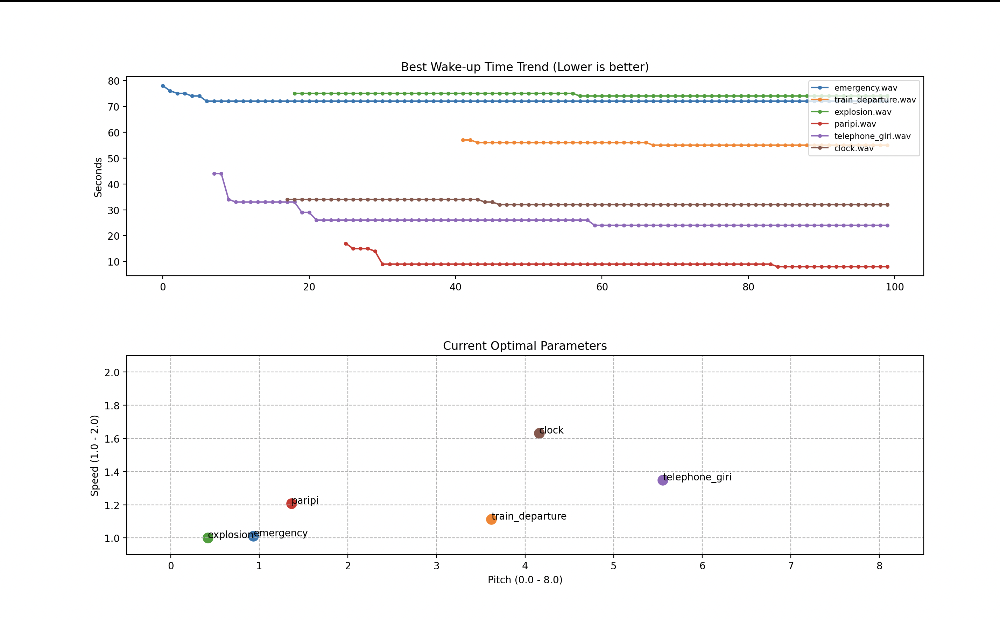
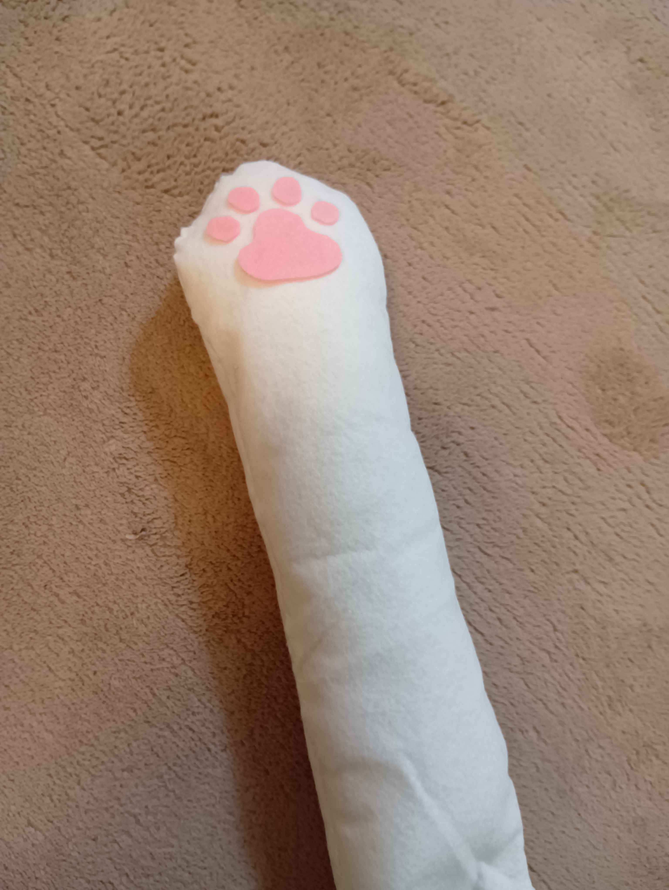
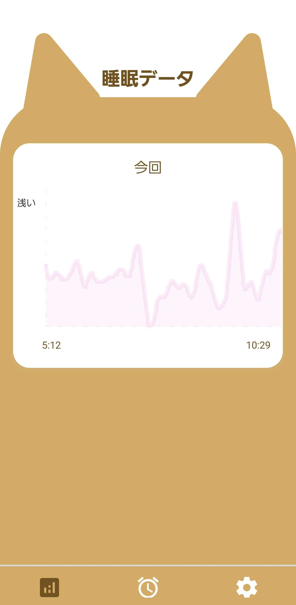
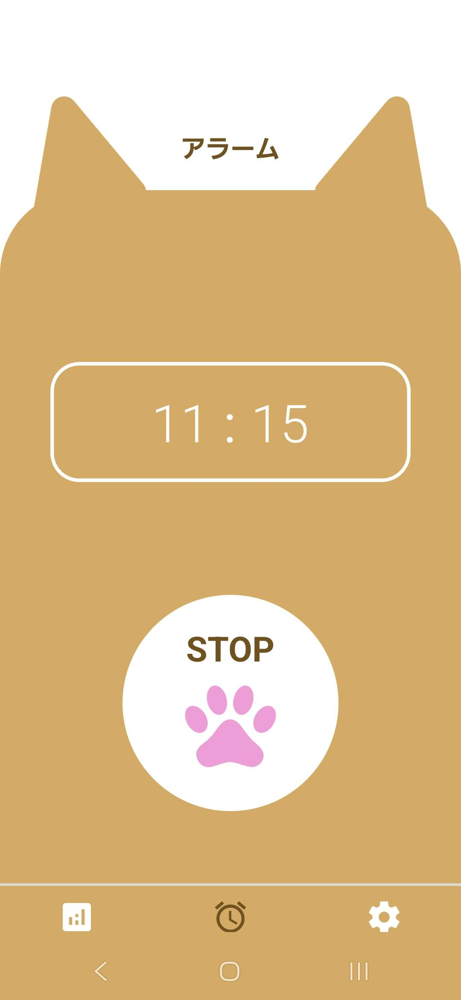
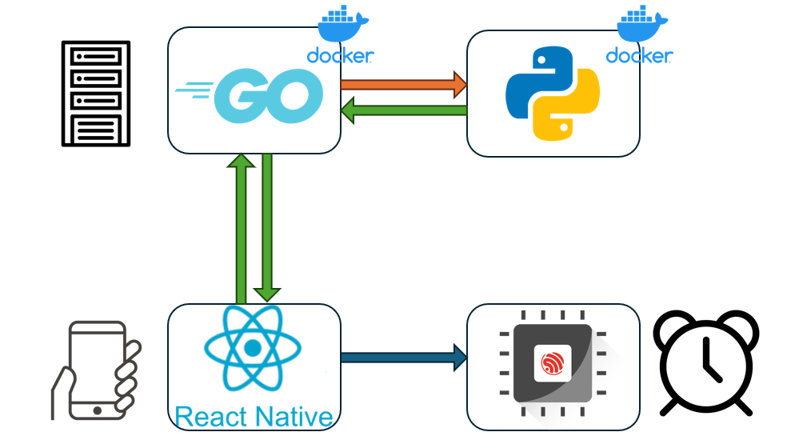

# 絶対に起きられる目覚まし

## チーム名
チーム2 幻影旅団
## 背景・課題・解決されること

**■ 背景**
* 毎朝アラームの音に慣れてしまい、無意識に止めて二度寝をしてしまう
* 気合いや普通の音だけに頼るのではなく、日々進化するAIテクノロジーと「物理的なアプローチ」で確実に目を覚ます体験を作りたい

**■ 課題**
* 毎日同じアラーム音を聞いていると脳が慣れてしまい、徐々に効果が薄れてしまう（音のマンネリ化）
* 深い眠りの時に無理やり起こされると不快感が強く、寝起きのだるさや二度寝の最大の原因になる

**■ 解決されること**
* 「AIによる最適なタイミングでのアラーム」と「設定時刻のIoT往復猫パンチ（物理刺激）」の究極の二段構えで、二度寝を完全に防ぎます。
* 睡眠解析で「一番起きやすいタイミング」を狙い撃ちしつつ、最終的には物理で強制起床させる確実な目覚めを提供します。

## プロダクト説明

**1. AIによるアラーム音の自己学習**
「どんな音を流した時に、一番早く寝返りを打って起きたか」をAIが日々学習。単なるアラームではなく、使えば使うほどあなた専用の「絶対に起きられる音」へと進化していくスマートな目覚ましです。

**2. 起床30分前からの誘導 ＆ 寝返り検知での「音量MAX」**
設定時刻の30分前から、AIが生成した微かなアラーム音を流し始めます。その後、ユーザーが「寝返りを打った（＝眠りが浅くなった）」瞬間をアプリが検知し、絶好のタイミングでアラーム音を最大音量にしてスマートな起床を促します。

**3. 往復猫パンチによる強制起床（最終兵器・IoT）**
音量MAXのアラームでも起きられず、ついに「設定時刻」を迎えてしまった場合の最終兵器です。時間になった瞬間、顔元に設置したIoTデバイスが「往復猫パンチ」を物理的に叩き込みます。音の限界を物理的アプローチで突破し、一撃で強制起床させます。

**4. 睡眠解析トラッキング**
最高の「音を大きくするタイミング」を測るため、スマホのセンサーで一晩の睡眠サイクルを裏側で解析しています。美しい波形グラフとして振り返ることも可能です。

## 操作説明・デモ動画
最終発表でデモ動画します
## 注力したポイント

### アイデア面
* 「最高のタイミングの音」で優しく起こしつつ、設定時刻には「IoT猫パンチ」で容赦なく殴って起こすという、アメとムチを兼ね備えた究極のアプローチ
* 毎日同じ音で起きられない問題を「AIの自己学習」で解決するスマートさと、「顔面を叩く」という物理的ギャグのギャップ

### デザイン面
* （※ここにIoTデバイスの外観の工夫や、猫パンチの動きのこだわりなどを書いてください。例：遊び心のある「猫の手」のハードウェアデザインなど）
* アプリ側はIOTが猫の手なので可愛らしい猫をモチーフにデザインしました。

### その他
* AIにユーザーの反応データを学習させ、最適なアラーム音を生成・進化させるプロンプトと処理の工夫
* サブ機能である睡眠解析には本格的なアルゴリズムを採用。スマホの揺れと音量からノイズを除去し、ガウシアンスムージング（平滑化処理）をかけることで、「寝返りを打った瞬間」をシステム側で正確に計算しています。

## 技術スタック

**フロントエンド**
* React Native (Expo)

**バックエンド**
* GO(Frontendとの接続)

**インフラ・AI**
* IoTデバイス（※Arduino, ESP32, サーボモーターなど使用デバイスを記載）
* 生成AI / 機械学習API（※Gemini APIなど、音の生成・学習に使用しているものを記載）